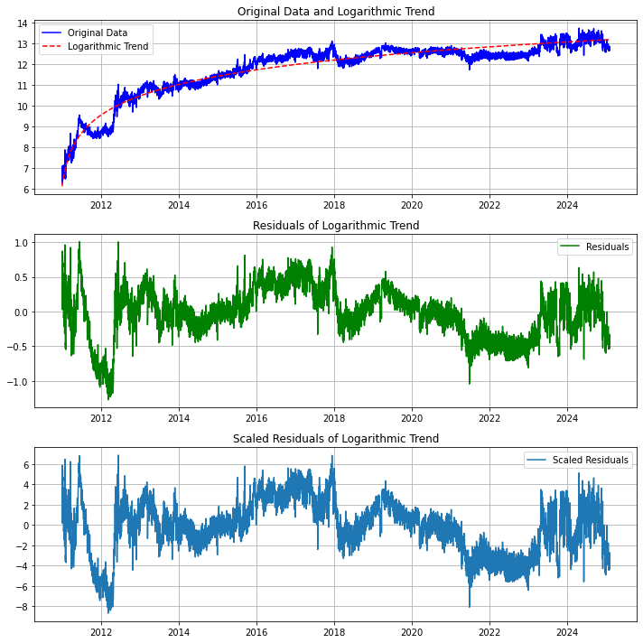
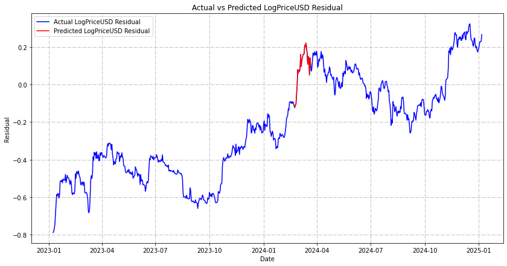

### Repository Summary ###
- Task: Time Series Forecasting
- Model Type: RNN, LSTM, Transformer, MAMBA

## **Sequence-to-Sequence Time Series Forecasting with Multi-Feature Inputs**  ##
This project investigates **sequence-to-sequence time series forecasting** using multi-feature inputs, leveraging various deep learning architectures to model temporal dependencies. A key focus is on **detrending via logarithmic transformations** and residual forecasting, allowing for more stable and interpretable predictions.  

## Methodology ##
To improve forecasting stability and mitigate non-stationarity, we apply the following transformations:  

### 1. Logarithmic Trend Extraction ###
Given an observation <code>Yt</code>, we approximate its underlying trend using a logarithmic function of the form: 

**Yt = a + b * log(Xt + c)**

where <code>Xt</code> represents the time index transformed into an integer format, and <code>(a, b, c)</code> are estimated via non-linear least squares fitting. This transformation is particularly effective in capturing **exponential-like growth** while ensuring numerical stability in cases of small <code>Xt</code>.  

### 2. Residual Computation ###
After estimating the log trend <code>Ŷt</code>, the residual component is obtained as:

**Rt = Yt - Ŷt**

This isolates short-term fluctuations, allowing the forecasting model to learn purely stationary residual dynamics without being influenced by global trend variations. Below is an example of the computation on a single feature.

### 3. Multi-Feature Residual Forecasting ###
Instead of forecasting the absolute values of <code>Yt</code>, we predict the residual components <code>Rt</code> using multiple transformed features. The model learns an implicit mapping:

**∑i=1k (Rt-n(i), ..., Rt(i))  →  (Rt+1, ..., Rt+m)**
 
where <code>n</code> and <code>m</code> denote the historical and forecasting horizons, respectively.

### 4. Inverse Transformation for Final Prediction ###
After forecasting <code>(Rt+1, ..., Rt+m)</code>, we reconstruct the final time series prediction as:

**(Yt+1, ..., Yt+m) = (Ŷt+1, ..., Ŷt+m) + (Rt+1, ..., Rt+m)**

ensuring consistency with the original data distribution.

## Modeling Approaches ##
We experimented with several sequence modeling architectures, each incorporating different mechanisms for temporal feature extraction:

| Model                          | Description                                                   |
|-----------------------------------------|--------------------------------------------------------|
| **SegRNN** | A segment-wise **Recurrent Neural Network (RNN)** that dynamically partitions sequences, improving computational efficiency while preserving recurrent state transitions. |
| **Simple LSTM** | A **vanilla LSTM** trained on sequential residuals to capture temporal dependencies over fixed-length windows. |
| **Seq2Seq LSTM** | An **encoder-decoder LSTM** architecture designed for multi-step forecasting, enabling the model to learn dynamic representations across different sequence lengths. |
| **Attention LSTM** | An **LSTM augmented with an attention mechanism**, allowing selective weighting of past time steps to enhance long-term dependency retention. |
| **Transformer** | A self-attention-based model that removes recurrence, leveraging **multi-head attention** to capture both local and global dependencies. |
| **MambaSSM** | A **state-space model (SSM)** optimized for long-range forecasting, leveraging structured state transitions and memory-efficient recurrence to outperform traditional RNN-based architectures. |

## Results & Findings ##
- **MambaSSM demonstrated superior performance**, effectively capturing long-range dependencies while maintaining computational efficiency.
- **Log transformation + residual forecasting significantly improved stability**, leading to better generalization across different time horizons.
- **MambaSSM outperformed traditional models** such as Simple LSTM and Seq2Seq LSTM, and even the attention-based models, by a significant margin.

## References ##
Fuck you I wrote them all.
Okay maybe I will add some references in the future.
