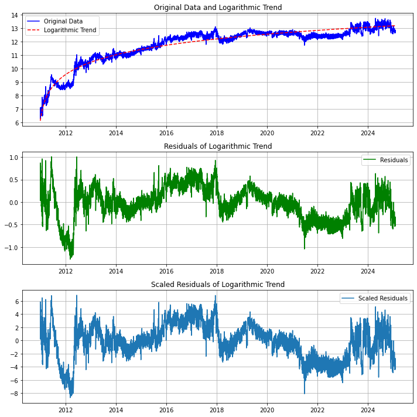
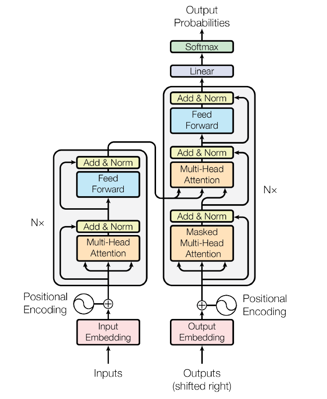
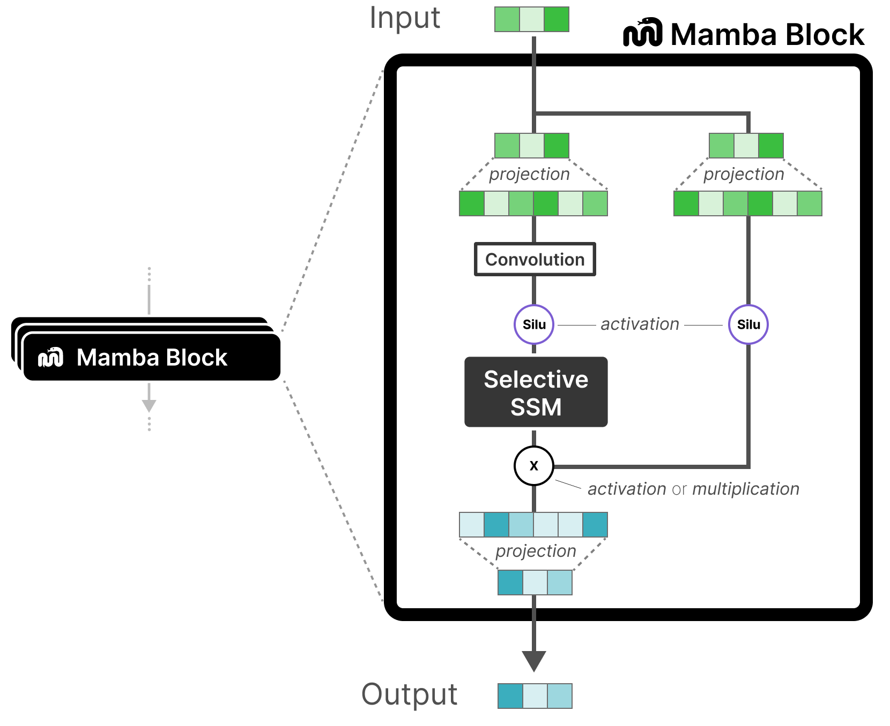
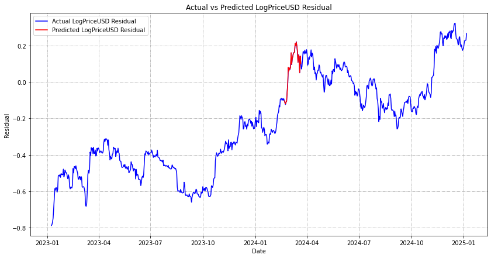

# Sequence-to-Sequence Time Series Forecasting with Multi-Feature Inputs

**Task:** Time Series Forecasting &nbsp;|&nbsp; **Architectures:** RNN, LSTM, Transformer, Mamba

---

## Abstract

This project investigates sequence-to-sequence time series forecasting using multi-feature inputs across a range of deep learning architectures. A central failure mode in financial time series forecasting is the **naive lag-1 baseline**, where models learn to approximate the next value as the current value — producing predictions that appear correlated with ground truth but carry no genuine predictive signal. 

This project addresses the lag-1 problem through three complementary mechanisms: a logarithmic detrending pipeline that removes the smooth trend component driving autocorrelation, multi-feature on-chain inputs that introduce orthogonal signals beyond price history, and architecture-level selectivity in MambaSSM that discourages trivial state copying across timesteps. 

Experiments compare six architectures — SegRNN, LSTM, Seq2Seq LSTM, Attention LSTM, Transformer, and MambaSSM — on the same 30-day forecasting task trained on approximately one year of data, with MambaSSM achieving the best performance and the strongest resistance to lag-1 degeneracy among all tested models.

---

## 1. Methodology

A persistent failure mode in financial time series forecasting is the **naive lag-1 baseline**: a model that outputs $\hat{Y}_{t+1} \approx Y_t$ achieves deceptively low error on non-stationary series driven by smooth trends, while providing no genuine predictive value. The methodology is structured to break this degeneracy at three levels.

### 1.1 Logarithmic Trend Extraction

Given an observation <code>Yt</code>, the underlying trend is approximated by fitting a logarithmic function of the form:

$$Y_t = a + b \cdot \log(X_t + c)$$

where <code>Xt</code> is the integer-encoded time index and <code>(a, b, c)</code> are estimated via non-linear least squares. This form is well-suited to data exhibiting exponential-like growth and remains numerically stable for small <code>Xt</code>.

By explicitly fitting and removing the trend, the model is prevented from exploiting slow-moving autocorrelation as a shortcut — the primary mechanism through which lag-1 degeneracy arises in price series.

### 1.2 Residual Computation

The residual component is obtained by subtracting the fitted trend:

$$R_t = Y_t - \hat{Y}_t$$

This isolates stationary short-term fluctuations from the global trend, allowing each model to focus on residual dynamics rather than long-run drift. An example of the transformation on a single feature is shown below.

### 1.3 Multi-Feature Residual Forecasting

Rather than predicting absolute values, the models are trained to forecast residual sequences. Given <code>k</code> input features (k=6: mining difficulty, transaction count, active addresses, 30-day active supply, 1-year active supply, and log price), the learned mapping takes the form:

$$\sum_{i=1}^{k} \left( R_{t-n}^{(i)}, \ldots, R_{t}^{(i)} \right) \rightarrow \left( R_{t+1}, \ldots, R_{t+m} \right)$$

where <code>n</code> and <code>m</code> denote the lookback and forecasting horizons, respectively.

The inclusion of on-chain features orthogonal to price history is the second anti-lag mechanism: a model that simply copies its last input state cannot satisfy the joint constraint imposed by structurally independent feature channels.

### 1.4 Inverse Transformation

Final predictions are reconstructed by adding the forecasted residuals back to the trend estimates:

$$\left( Y_{t+1}, \ldots, Y_{t+m} \right) = \left( \hat{Y}_{t+1}, \ldots, \hat{Y}_{t+m} \right) + \left( R_{t+1}, \ldots, R_{t+m} \right)$$

---

## 2. Models

| Model | Description |
|---|---|
| SegRNN [1] | A segment-wise RNN that partitions input sequences into fixed-length segments, improving computational efficiency while preserving recurrent state transitions. |
| Simple LSTM [2] | A vanilla LSTM trained directly on residual sequences over fixed-length windows. |
| Seq2Seq LSTM [3] | An encoder-decoder LSTM designed for multi-step forecasting, enabling variable-length input-output mappings. |
| Attention LSTM | An LSTM augmented with an additive attention mechanism, allowing selective weighting of past hidden states. |
| Transformer [4] | A fully attention-based architecture that removes recurrence, leveraging multi-head self-attention to capture both local and global temporal dependencies. |
| MambaSSM [5,6] | A structured state-space model (SSM) with selective state transitions, offering linear-time complexity and strong performance on long-range sequence modeling. The input-dependent selection mechanism explicitly gates which information is propagated across timesteps, providing architecture-level resistance to trivial lag-1 state copying. |

---

## 3. Architecture Diagrams

The two primary architectures evaluated in this project are illustrated below.

**Transformer** — encoder-decoder architecture with multi-head self-attention and positional encoding ([4]):

**Mamba Block** — selective SSM with dual-branch projection, depthwise convolution, and SiLU gating ([5,6]):

---

## 4. Results

MambaSSM achieved the best forecasting performance among all tested architectures on the 30-day forecasting horizon. Critically, the predicted sequences avoid the lag-1 pattern — a common failure mode in financial forecasting where model output is visually indistinguishable from a one-day shift of the input series. This is reflected in the forecast curves: rather than tracking a lagged copy of the input, the model produces predictions that diverge from the immediate prior trajectory where the residual signal warrants it.

The log-detrending pipeline was the first line of defense against this failure mode, eliminating the smooth autocorrelation that makes lag-1 strategies cheap to learn. Multi-feature on-chain inputs imposed orthogonal constraints that further prevented the model from collapsing to univariate copying. MambaSSM's selective state mechanism provided the final layer of resistance: by learning which historical context to gate rather than uniformly propagating all state, it avoids the recurrent shortcut that causes LSTM-class models to exhibit residual lag. RNN and LSTM baselines (including Seq2Seq and Attention variants) showed the most visible lag-1 tendency in their output curves; Transformer and Mamba models were substantially more resistant.

---

## 5. References

[1] Lin, S., Lin, W., Wu, W., Zhao, F., Mo, R., & Zhang, H. (2023). SegRNN: Segment Recurrent Neural Network for Long-Term Time Series Forecasting. *arXiv:2308.11200*. https://arxiv.org/abs/2308.11200

[2] Hochreiter, S., & Schmidhuber, J. (1997). Long Short-Term Memory. *Neural Computation, 9*(8), 1735–1780. https://www.bioinf.jku.at/publications/older/2604.pdf

[3] Sutskever, I., Vinyals, O., & Le, Q. V. (2014). Sequence to Sequence Learning with Neural Networks. *NeurIPS 2014*. https://arxiv.org/abs/1409.3215

[4] Vaswani, A., Shazeer, N., Parmar, N., Uszkoreit, J., Jones, L., Gomez, A. N., Kaiser, L., & Polosukhin, I. (2017). Attention Is All You Need. *NeurIPS 2017*. https://arxiv.org/abs/1706.03762

[5] Gu, A., & Dao, T. (2023). Mamba: Linear-Time Sequence Modeling with Selective State Spaces. *arXiv:2312.00752*. https://arxiv.org/abs/2312.00752

[6] Gu, A., Goel, K., & Ré, C. (2021). Efficiently Modeling Long Sequences with Structured State Spaces. *ICLR 2022*. https://arxiv.org/abs/2111.00396

---

## Appendix: Data Pipelines

Two data pipelines are provided under different feature and trend assumptions:

- **`DataTransformation.py`** — Primary pipeline. Sources on-chain data from CoinMetrics (difficulty, transaction count, active addresses, active supply). Applies logarithmic trend removal. Used in all reported experiments.
- **`DataTransformation2.py`** — Experimental pipeline. Sources OHLCV data from the Binance API. Applies linear trend removal. Not used in reported results; retained for reference.

---

## Implementation Note

The MambaSSM block implementation (`class/MambaSSM.py`, `class/scans.py`) is adapted from [johnma2006/mamba-minimal](https://github.com/johnma2006/mamba-minimal), a community reference implementation of [5]. The selective scan kernel, RMSNorm, and block structure follow that reference. The forecasting wrapper, input/output projection layers, training loop, and data pipeline are original.
