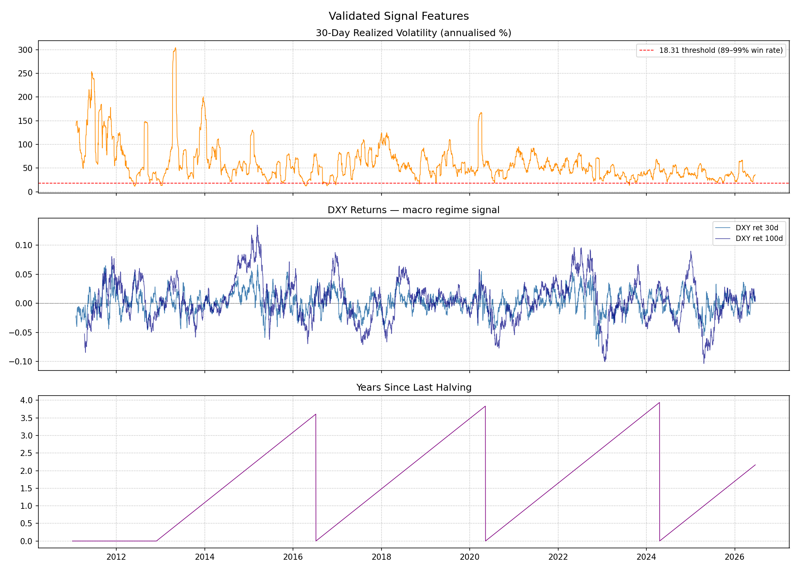
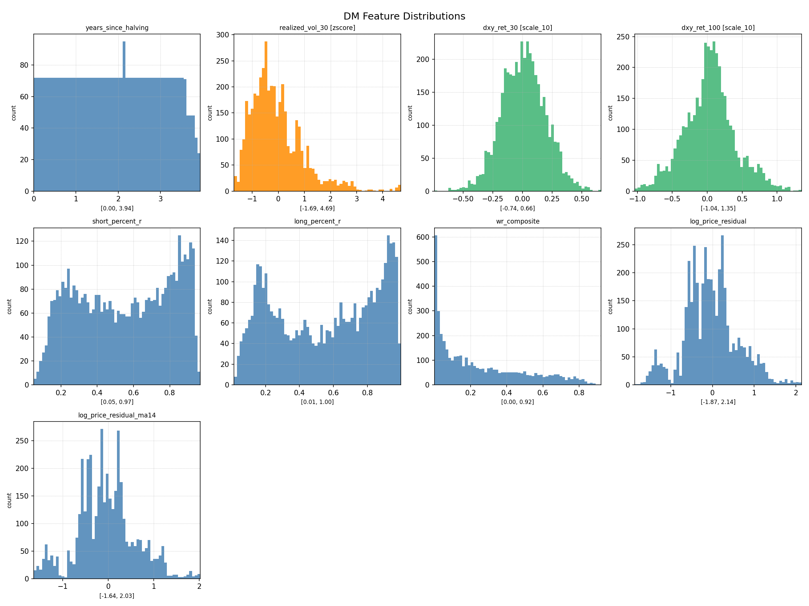
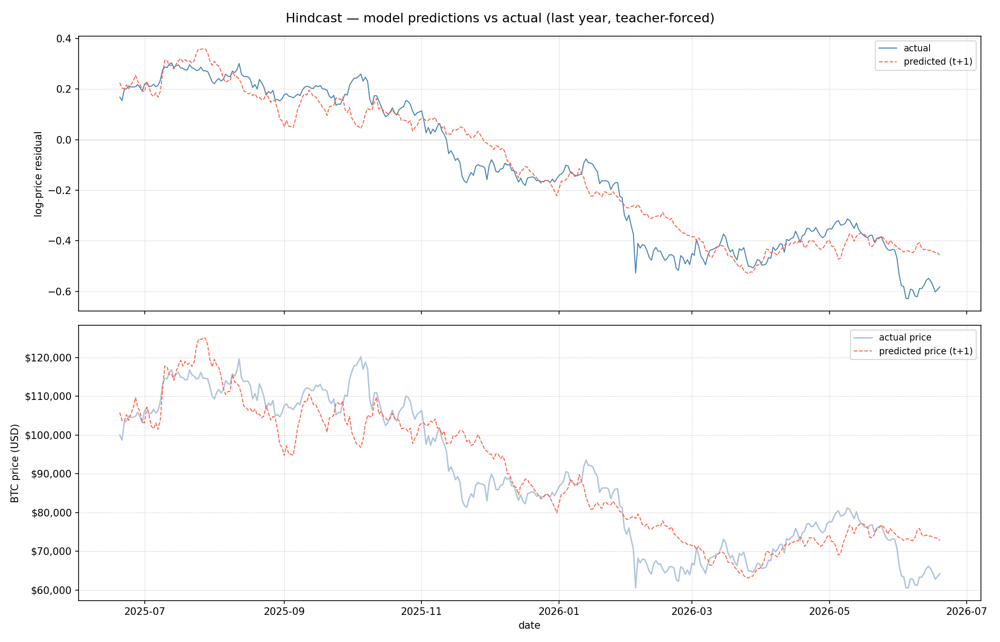
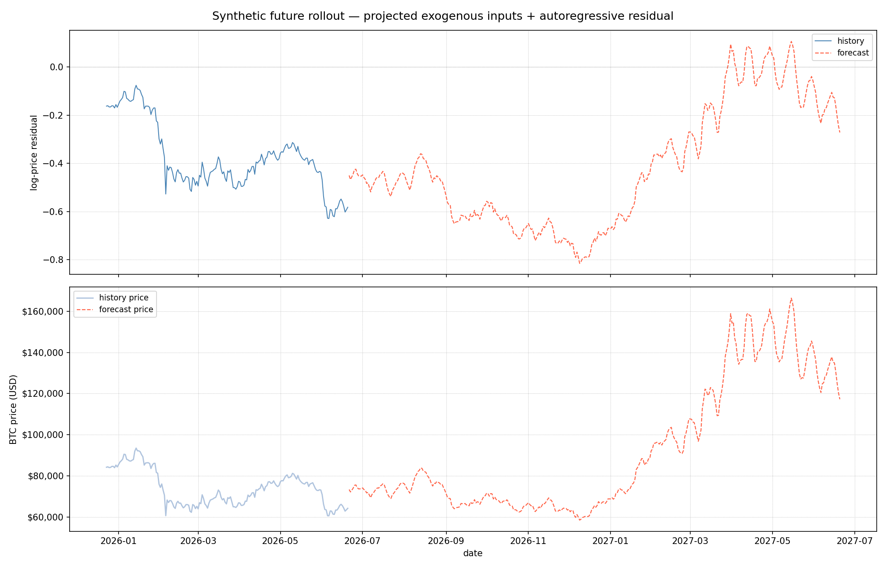

[](https://)
[](https://)
[](https://)

# Sequence-to-Sequence Time Series Forecasting with a Selective State-Space Model

**Task:** Multi-feature BTC time series forecasting &nbsp;|&nbsp; **Model:** MambaSSM

---

## Abstract

A MambaSSM pipeline for multi-feature BTC log-price residual forecasting. The model is a **multi-horizon, sparse-window forecaster**: for each anchor date $t$, it sees seven distinct 7-day windows from the past and predicts the residual sequence $t+1 \dots t+7$.

The design tries to break trivial lag-copy behaviour at three levels:

- **Detrending** — a logarithmic trend is fitted and removed, eliminating the smooth autocorrelation that makes lag-copying cheap to learn
- **Window isolation** — each historical window is encoded independently, so long calendar gaps never become one shared recurrence the model can simply copy through
- **Explicit autoregression** — the raw residual is both an input feature and the prediction target, making compounding forecast error visible instead of hidden behind smoothing

Two experiments were conducted against a **lag-1 persistence baseline** (predict next residual = current residual, next-day MSE **0.001215** on the random val set). On a random 90/10 split the model achieves next-day MSE **0.001212**, narrowly beating lag-1; on a strict chronological 90/10 split reserving approximately one year as a hold-out, the model does not reliably outperform lag-1. The `val_loss ≤ 0.015` hard stop in the production training run is derived from the chronological experiment. This codebase retains only the production training and forward-projection pipeline; the evaluation scripts are not checked in.

---

## 1. Methodology

### 1.1 Logarithmic Trend Extraction

The underlying price trend is approximated by a logarithmic function:

$$Y_t = a + b \cdot \log(X_t + c)$$

- $X_t$ — integer-encoded time index (days since data start)
- $(a, b, c)$ — estimated from the observed history
- $c$ is fitted once globally; $a$ and $b$ are updated cumulatively at each row via expanding-window OLS, so residual[t] only uses data available up to t

This form handles exponential-like growth while remaining numerically stable for small $X_t$. By removing the trend explicitly, the model cannot exploit slow-moving autocorrelation as a shortcut.

### 1.2 Residual Computation

$$R_t = Y_t - \hat{Y}_t$$

- Isolates stationary short-term fluctuations from the global drift
- The residual oscillates around zero — mean-reversion is the dominant regime
- All downstream modelling operates on $R_t$, not on raw prices

### 1.3 Multi-Feature Residual Forecasting

The model predicts the raw log-price residual sequence $t+1 \dots t+7$ from a sparse lookback of multi-feature inputs. The feature set is assembled in [stage 3](#4-pipeline) and comprises 8 input channels plus the target:

| Group | Features |
|---|---|
| Cycle | years since last halving |
| Volatility | 30-day realized volatility (z-scored) |
| Macro | DXY 30-day return (×10), DXY 100-day return (×10) |
| Technical | Williams %R short (21d, EMA-3), Williams %R long (112d, EMA-3), WR composite |
| Autoregressive | current `log_price_residual` |
| **Target** | **future `log_price_residual`** |

For each anchor day $t$, the input is a set of non-contiguous **windows** at fixed anchors (currently `[365, 180, 90, 75, 60, 45, 30]` days before $t$). Each anchor contributes a consecutive 7-day window, giving an input tensor of shape `(batch, n_windows, window_len, n_features)`. The learned mapping is:

$$\left( W_{t - a_1}, \ldots, W_{t - a_k} \right) \rightarrow \left(R_{t+1}, \ldots, R_{t+7}\right)$$

where $a_1 > \ldots > a_k$ are the window anchors and each $W_{t-a}$ is a 7-day sequence. The nearest observed input day is **t-30** and the nearest window spans **t-36 … t-30**, so the model never sees the most recent 29 days of residual history directly.

<div align="center"></div>

The three signal groups over the full data history:

- **Top — 30-day realized volatility (annualised %):** the dashed red line at 18.31% marks the threshold below which long-horizon win rates exceed 89% (established in the companion winrate-matrix analysis). Volatility spikes identify capitulation and euphoria phases with strong mean-reversion signal at multi-month horizons.
- **Middle — DXY 30-day and 100-day returns:** negative USD momentum historically anti-correlates with BTC strength. The 100-day series captures longer regime shifts that a short window would miss.
- **Bottom — years since last halving:** positions the current date within the 4-year supply-emission cycle, distinguishing accumulation from distribution phases.

### 1.4 Feature Normalization

The DM dataset is assembled by selecting the validated features from the DWD and applying per-feature transforms. Three transforms are used:

- **Z-score (orange)** — mean and variance fitted on the full observed dataset, applied to `realized_vol_30`
- **×10 linear scale (green)** — fixed multiplier applied to `dxy_ret_30` and `dxy_ret_100`, whose raw values (~0.02) sit two orders of magnitude below the residual; the fixed scale preserves threshold semantics without data-dependent fitting
- **None (blue)** — features already on a natural or bounded scale (`years_since_halving`, Williams %R signals, `log_price_residual`)

<div align="center"></div>

### 1.5 Inverse Transformation

Final price predictions are reconstructed by adding the forecasted residuals back to the trend:

$$\hat{P}_{t+k} = \exp\!\left(\hat{R}_{t+k} + \hat{Y}_{t+k}\right)$$

- The trend parameters fitted in stage 2 are persisted to `trend_params.json`
- Stage 5 loads them to reconstruct USD prices over the synthetic future rollout

---

## 2. Model

**MambaSSM** is a structured state-space model with selective state transitions:

- **Linear-time complexity** — recurrent structure scales with sequence length, not quadratically
- **Input-dependent gating** — the selection mechanism learns which intra-window context to propagate
- **Log-domain scan** — the `logcumsumexp` selective scan kernel is numerically stable for long sequences

The model maps a sparse lookback of shape `(batch, n_windows, window_len, n_features)` to a prediction of shape `(batch, predict_window)`. A shared Mamba encoder processes each 7-day window separately; the per-window terminal states are concatenated and projected to the 7 forecast horizons.

**Mamba Block** — selective SSM with dual-branch projection, depthwise convolution, and SiLU gating ([1, 2]):

<div align="center"></div>

---

## 3. Repository Structure

```
src/ssm/                         # importable package
  config.py                      # cross-stage contract: paths, artifact names, horizons, hyperparameters
  arch/mamba.py                  # MambaSSM model + create_model factory
  arch/scans.py                  # selective-scan kernels
  data/loader.py                 # sliding-window DataLoader construction
pipeline/
  step_1_data_ingestion.py       # raw sources  -> ODS
  step_2_feature_engineering.py  # ODS          -> DWD (features) + trend params
  step_3_dm.py                   # DWD          -> DM + norm params
  step_4_train.py                # DM           -> checkpoint + train metadata
  step_5_evaluate.py             # checkpoint   -> synthetic future rollout csv + figure
output/                          # generated artifacts and reference outputs
```

Configuration is split by locality:

- **`src/ssm/config.py`** — everything that crosses a stage boundary: directory paths, artifact filenames, window anchors, model and training hyperparameters
- **Stage-local config** — the feature registry in stage 3 and the oscillator tables in stage 2 stay in their own files; they are not shared across stages

Most heavy intermediates in `output/` are regenerated locally; selected derived artifacts such as figures, the checkpoint, and metadata may be checked in for reference.

### Setup

```bash
pip install -e .
```

Installs the `ssm` package in editable mode (`src/` layout) so all `pipeline/` scripts can `import ssm` without path hacks.

---

## 4. Pipeline

Each stage reads the previous stage's artifacts from `output/` and writes its own. Artifact filenames are the inter-stage contract, defined once in `config.py`.

| Stage | Script | Reads | Writes |
|---|---|---|---|
| 1 — Ingestion | `pipeline/step_1_data_ingestion.py` | CoinMetrics, yfinance | `step1_ods.csv` |
| 2 — Features | `pipeline/step_2_feature_engineering.py` | `step1_ods.csv` | `step2_dwd.csv`, `trend_params.json`, figures |
| 3 — DM | `pipeline/step_3_dm.py` | `step2_dwd.csv` | `step3_dm.csv`, `norm_params.json`, figure |
| 4 — Train | `pipeline/step_4_train.py` | `step3_dm.csv` | `checkpoints/MambaSSM_best.pt`, `train_meta.json` |
| 5 — Evaluate | `pipeline/step_5_evaluate.py` | all of the above | `step5_rollout.csv`, `step5_fig_evaluation.png` |

```bash
python pipeline/step_1_data_ingestion.py
python pipeline/step_2_feature_engineering.py
python pipeline/step_3_dm.py
python pipeline/step_4_train.py
python pipeline/step_5_evaluate.py
```

Stages 1–3 are CPU/network bound; stage 4 uses CUDA if available and falls back to CPU.

---

## 5. Results

The baseline for both experiments is the **lag-1 persistence model**: predict the next residual as equal to the current one ($\hat{R}_{t+1} = R_t$). On the random val set (seed 42, 380 anchors) the lag-1 next-day MSE is **0.001215**.

### 5.1 Random-Split Experiment

Training uses a random 90/10 split over the full DM dataset (`val_seed = 42`), drawing approximately 380 val samples from across the full history. The training objective is MSE over the joint 7-step horizon `t+1 … t+7`; the model–baseline comparison is evaluated on the **next-day (t+1) step only**.

| | Next-day MSE |
|---|---|
| MambaSSM | **0.001212** |
| Lag-1 baseline | 0.001215 |

**Caveat:** the random split allows neighboring anchors with overlapping 7-day target windows to land on both sides of the train/val boundary. The val score is optimistic by construction and should be read as a training-control signal, not a clean generalization estimate.

### 5.2 Chronological-Split Experiment

A strict chronological 90/10 split reserves approximately one year as an uncontaminated hold-out. On this window the model did **not** reliably outperform the lag-1 baseline. In this experiment, training loss and validation loss started to diverge once reached 0.015, signifying overfit. 

The `TARGET_VAL_LOSS ≤ 0.015` guardrail is derived from this experiment: it marks the level below which the random-split score enters overfit territory on the chronological hold-out.

This repository retains only the production pipeline. The chronological evaluation scripts are not checked in.

The figure below shows the model run teacher-forced over the last year of observed data — real inputs at every step, no autoregression. It is an in-sample hindcast, not a held-out evaluation, and reflects the overfitting dynamic described above.

<div align="center"></div>

### 5.3 Synthetic Future Rollout

Stage 5 performs a **synthetic future rollout** beyond the last observed date:

- `years_since_halving` is computed deterministically for future dates
- the six exogenous non-deterministic features are projected independently by separate cycle-aligned linear regressions
- `log_price_residual` is forecast autoregressively and fed back into the next forecast window
- forecast errors are therefore allowed to compound, by design

<div align="center"></div>

The plot above is a **synthetic forward simulation**, not a held-out real-market evaluation. It visualizes how the residual forecast and reconstructed price behave when the model is rolled forward with projected exogenous inputs.

| Metric | Value | Description |
|---|---|---|
| **Forecast start** | **2026-06-21** | First synthetic future date after the observed history |
| **Forecast horizon** | **365 days** | Number of forward-simulated dates |

---

## 6. Conclusion

This study is complete. MambaSSM demonstrated the strongest resistance to lag-1 degeneracy among all tested architectures and produced a well-behaved residual forecast, but the approach faces a fundamental data-availability constraint: the BTC daily series offers roughly 4,000 usable rows — too few to expose the model's capacity advantage over simpler methods in out-of-sample conditions.

The companion [winrate-matrix](https://github.com/chengmarc/winrate-matrix) analysis found that threshold-based signals (low realized volatility, DXY regime) yield win rates of 89–99% at multi-month horizons without any learned parameters, outperforming the neural net on the chronological held-out window. Given this, further iteration on MambaSSM was discontinued.

The checked-in artifacts — checkpoint, figures, and rollout CSV — document the final trained state. The stage-5 rollout is retained as a scenario projection, not a performance claim.

---

## 7. Prior Work

Earlier in this project a set of recurrent and attention architectures were explored on the same forecasting task. They are not part of the maintained codebase but are summarised here for context.

| Model | Description |
|---|---|
| SegRNN [3] | Segment-wise RNN that partitions input sequences into fixed-length segments. |
| Simple LSTM [4] | Vanilla LSTM trained directly on residual sequences over fixed-length windows. |
| Seq2Seq LSTM [5] | Encoder-decoder LSTM for multi-step forecasting. |
| Attention LSTM | LSTM augmented with additive attention over past hidden states. |
| Transformer [6] | Fully attention-based architecture using multi-head self-attention. |

RNN/LSTM baselines showed the most visible lag-1 tendency; Transformer and Mamba models were substantially more resistant.

---

## 8. References

[1] Gu, A., & Dao, T. (2023). Mamba: Linear-Time Sequence Modeling with Selective State Spaces. *arXiv:2312.00752*. https://arxiv.org/abs/2312.00752

[2] Gu, A., Goel, K., & Ré, C. (2021). Efficiently Modeling Long Sequences with Structured State Spaces. *ICLR 2022*. https://arxiv.org/abs/2111.00396

[3] Lin, S., Lin, W., Wu, W., Zhao, F., Mo, R., & Zhang, H. (2023). SegRNN: Segment Recurrent Neural Network for Long-Term Time Series Forecasting. *arXiv:2308.11200*. https://arxiv.org/abs/2308.11200

[4] Hochreiter, S., & Schmidhuber, J. (1997). Long Short-Term Memory. *Neural Computation, 9*(8), 1735–1780. https://www.bioinf.jku.at/publications/older/2604.pdf

[5] Sutskever, I., Vinyals, O., & Le, Q. V. (2014). Sequence to Sequence Learning with Neural Networks. *NeurIPS 2014*. https://arxiv.org/abs/1409.3215

[6] Vaswani, A., et al. (2017). Attention Is All You Need. *NeurIPS 2017*. https://arxiv.org/abs/1706.03762

---

## 9. Implementation Note

The MambaSSM block implementation (`src/ssm/arch/mamba.py`, `src/ssm/arch/scans.py`) is adapted from [johnma2006/mamba-minimal](https://github.com/johnma2006/mamba-minimal), a community reference implementation of [1]:

- Selective scan kernel, RMSNorm, and block structure follow that reference
- Forecasting wrapper, input/output projection layers, training loop, and data pipeline are original
